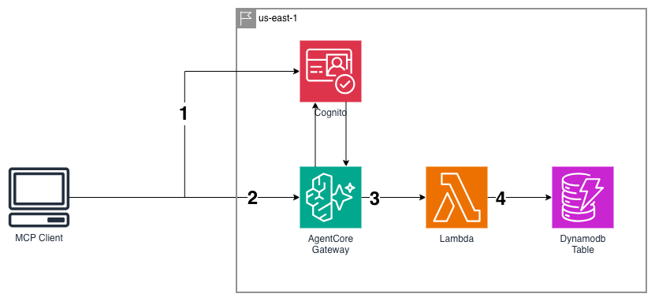
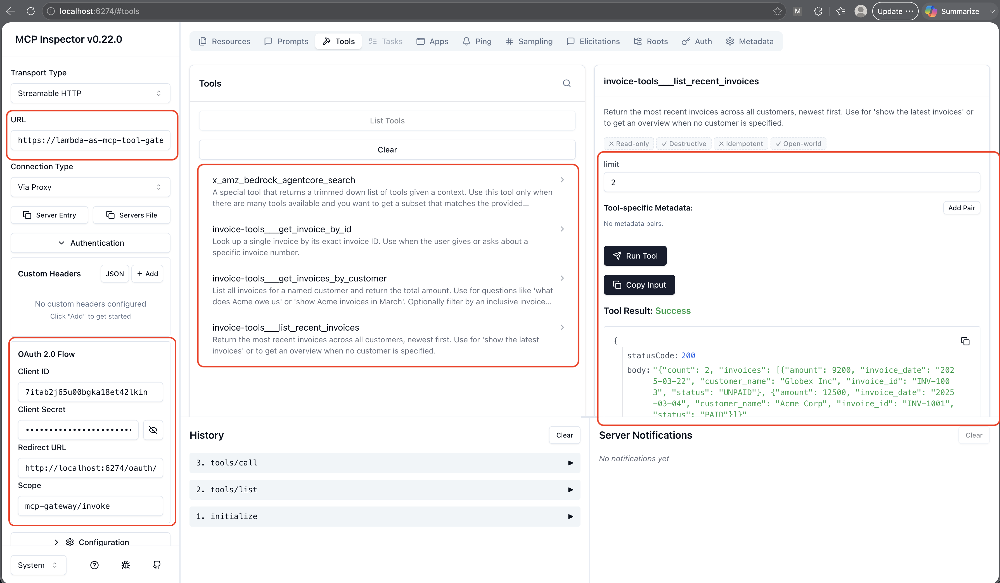

# Lambda as an MCP Tool - Bedrock AgentCore (CDK)

A minimal, self-contained CDK project for this pattern:

```
MCP Client (Claude.ai / Inspector / Agent) → Cognito (JWT)
                                           → AgentCore Gateway → Lambda (tool) → DynamoDB
```

No hand-written MCP server. **AgentCore Gateway speaks MCP on the front and invokes a
plain Lambda on the back.** The Lambda is the tool; a JSON schema is the contract.
Everything runs in `us-east-1`.



## Why this pattern

The usual way to give an agent a tool is to stand up an MCP server - a long-running
process with its own host, auth, and deployment. This pattern deletes that server.
Gateway handles the whole MCP surface (`tools/list`, `tools/call` routing, the
handshake, and the Cognito auth check); you write only the business logic and the
schema. Nothing runs when no one calls, so idle cost is zero - Lambda and DynamoDB
on-demand both bill per request.

## How it works

1. **Auth** - Client authenticates against a Cognito user pool and gets a JWT scoped to
   `mcp-gateway/invoke`. Server-to-server callers use client-credentials; browser
   clients (Claude.ai) use authorization-code.
2. **Call** - Client sends an MCP request to the Gateway with that token. The Gateway
   validates it against Cognito first - a request without a valid token never reaches
   the Lambda.
3. **Invoke** - Gateway translates an incoming `tools/call` into a Lambda invocation,
   passing the tool name and arguments.
4. **Data** - The Lambda routes on tool name and reads from DynamoDB (a GSI lets it
   query by customer instead of scanning).

## What's in here

```
app.py                                  CDK app entrypoint (us-east-1)
lambda_as_mcp_tool/
  lambda_as_mcp_tool_stack.py           DynamoDB + Lambda + Cognito + Gateway
lambdas/invoice_lambda/
  invoice_lambda.py                     Tool logic (3 tools, routed by name)
  tool_schema.json                      Tool definitions exposed over MCP
scripts/seed_invoices.py                Sample invoice data
tests/                                  Unit tests
```

### The tools

- `get_invoice_by_id` - one invoice by ID
- `get_invoices_by_customer` - all invoices for a customer + total (optional date range)
- `list_recent_invoices` - newest invoices across all customers

## Prerequisites

- Node.js + AWS CDK CLI (`npm install -g aws-cdk`), with the Bedrock AgentCore L2
  constructs (`aws_cdk.aws_bedrockagentcore`).
- Python 3.13+ (the Lambda runtime is 3.13), AWS credentials, a bootstrapped account
  in **us-east-1**.

## Deploy

```bash
python -m venv .venv && source .venv/bin/activate
pip install -r requirements.txt

cdk bootstrap            # once per account/region
cdk deploy
```

The Cognito domain prefix `mcp-invoice-poc` must be globally unique - if it's taken,
change it in `lambda_as_mcp_tool/lambda_as_mcp_tool_stack.py` (and the `TokenEndpoint`
output reflects it).

After deploy, note the stack outputs: `MCPGatewayURL`, `M2MClientId`, `UserPoolId`,
`TokenEndpoint`, `CognitoDiscoveryUrl`.

## Seed sample data

```bash
python scripts/seed_invoices.py
```

## Test it (M2M client + curl)

1. Get the M2M client secret (the output gives the ID; the secret lives in Cognito):

```bash
aws cognito-idp describe-user-pool-client \
  --user-pool-id <UserPoolId> \
  --client-id <M2MClientId> \
  --query 'UserPoolClient.ClientSecret' --output text
```

2. Get an access token (client credentials):

```bash
curl -s -X POST '<TokenEndpoint>' \
  -H 'Content-Type: application/x-www-form-urlencoded' \
  -u '<M2MClientId>:<ClientSecret>' \
  -d 'grant_type=client_credentials&scope=mcp-gateway/invoke'
```

3. List tools:

```bash
curl -s '<MCPGatewayURL>' \
  -H 'Authorization: Bearer <ACCESS_TOKEN>' \
  -H 'Content-Type: application/json' \
  -d '{"jsonrpc":"2.0","id":1,"method":"tools/list"}'
```

The Gateway returns each tool under its prefixed name
(`invoice-tools___get_invoices_by_customer`). Call one with that exact name:

```bash
curl -s '<MCPGatewayURL>' \
  -H 'Authorization: Bearer <ACCESS_TOKEN>' \
  -H 'Content-Type: application/json' \
  -d '{"jsonrpc":"2.0","id":2,"method":"tools/call",
       "params":{"name":"invoice-tools___get_invoices_by_customer",
                 "arguments":{"customer_name":"Acme Corp"}}}'
```

## Connect from Claude.ai / MCP Inspector

Browser clients use the **authorization-code** grant, so a Cognito user must exist:

```bash
aws cognito-idp admin-create-user \
  --user-pool-id <UserPoolId> --username user@example.com \
  --user-attributes Name=email,Value=user@example.com Name=email_verified,Value=true \
  --temporary-password 'TempPass123!'

aws cognito-idp admin-set-user-password \
  --user-pool-id <UserPoolId> --username user@example.com \
  --password 'MySecurePass123!' --permanent
```

In MCP Inspector pick **Streamable HTTP**, set the URL to `MCPGatewayURL`, and under
**OAuth 2.0** use the public client's ID/secret with scope `mcp-gateway/invoke`. From
Claude.ai, just add `MCPGatewayURL` as a custom connector - the
`https://claude.ai/api/mcp/auth_callback` callback is already registered.



## Two gotchas

**The tool name isn't in the event.** It's in
`context.client_context.custom["bedrockAgentCoreToolName"]`, prefixed with the target
name (`invoice-tools___get_invoice_by_id`). Split on `___` and route on the suffix.
`invoice_lambda.py` does this, with an event-based fallback so you can unit-test locally.

**The description is a prompt, not documentation.** Each tool's `description` and each
parameter's `description` are read by the model to decide *whether* and *how* to call
the tool. Write them like instructions to the model - when to use it, what each field
expects, an example value.

## Teardown

```bash
cdk destroy
```

The DynamoDB table and Cognito pool use `RemovalPolicy.DESTROY` for clean demo teardown.

---

Part of [AWS Serverless & AI Patterns](../README.md). Built by Kamran Moazim -
[X / @KamranMoazim](https://x.com/KamranMoazim).