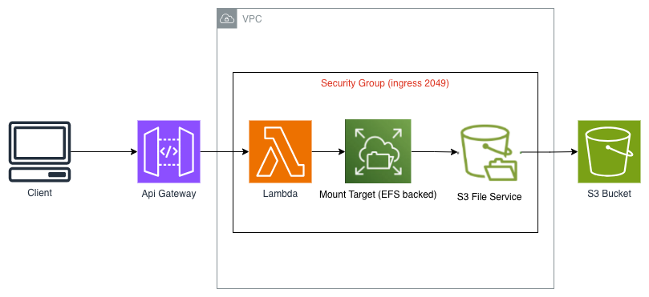
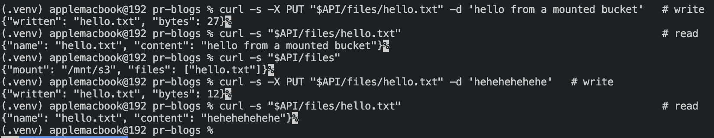

# S3 Files Demo — Mount an S3 Bucket as a Filesystem in Lambda (CDK)

```
Client → API Gateway → Lambda  ⇄  S3 bucket (mounted at /mnt/s3 via S3 Files)
```

The Lambda treats the bucket as a local directory — plain `open()`/`read()`/`write()`,
no boto3 transfer code. S3 Files (announced April 2026, EFS-backed) provides the NFS
mount and syncs to S3.


## What it deploys

- An S3 **bucket** with versioning (required by S3 Files)
- A **VPC** with two private *isolated* subnets and no NAT gateway
- One **security group** allowing NFS (2049) between its members
- An IAM **service role** S3 Files assumes to access the bucket
- `AWS::S3Files::FileSystem`, two `AWS::S3Files::MountTarget`, one `AWS::S3Files::AccessPoint`
- A **Lambda** that mounts the bucket at `/mnt/s3`
- A **REST API** (proxy) in front of the Lambda

These S3 Files resources have no CDK L2 module yet, so they're declared as L1
(`CfnResource`). CloudFormation waits for the (asynchronous) file-system creation to
finish before moving on, so no custom resource is needed.

## Deploy

```bash
python -m venv .venv && source .venv/bin/activate
pip install -r requirements.txt

cdk bootstrap        # once per account/region
cdk deploy
```

Note the outputs: `ApiUrl`, `BucketName`, `FileSystemId`.

## Test it

```bash
API="<ApiUrl>"     # e.g. https://abc123.execute-api.us-east-1.amazonaws.com/prod/

# write a file
curl -s -X PUT "$API/files/hello.txt" -d 'hello from a mounted bucket'

# read it back (instant on the same mount)
curl -s "$API/files/hello.txt"

# list files
curl -s "$API/files"

# delete it
curl -s -X DELETE "$API/files/hello.txt"
```


## Gotchas (the important ones)

- **VPC is mandatory.** The Lambda must be in the same VPC as the mount targets, with
  a security group allowing NFS (2049). This demo skips the NAT gateway because the
  function needs no internet — just the in-VPC mount.
- **Versioning required**, and once the file system is attached, direct S3 API *writes*
  to the bucket are restricted — S3 Files owns write coordination.
- **Access point `CreationPermissions`** are what make the root dir writable by the
  Lambda's POSIX user (UID 1000). Without them the mount works but writes fail.

## Teardown

```bash
cdk destroy
```

The file system is deleted before the bucket (dependency order), then
`auto_delete_objects` clears and removes the bucket.

---

Part of [AWS Serverless & AI Patterns](../README.md). Built by Kamran Moazim -
[X / @KamranMoazim](https://x.com/KamranMoazim).