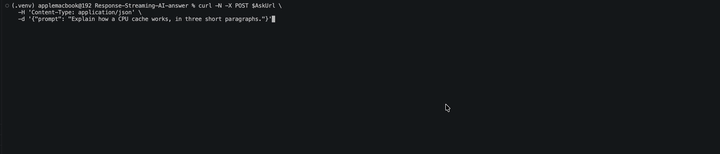

# Response-Streaming AI Answer - FastAPI + Web Adapter, via API Gateway (CDK)

```
Client → API Gateway REST (responseTransferMode=STREAM)
       → Lambda (FastAPI + Web Adapter) → Bedrock converse_stream → tokens streamed back
```

Python can't stream from a managed Lambda runtime, so the function is a FastAPI app
packaged as a container image with the **Lambda Web Adapter** as an extension. The
adapter streams the same way whether it's behind a Function URL or API Gateway; here
we use **API Gateway REST streaming** (`responseTransferMode: STREAM`)
so the endpoint sits behind the normal REST front door.

## Layout

```
Response-Streaming-AI-answer/
├── app.py                                  # CDK entrypoint
├── response_streaming_ai_answer_stack/
│   └── response_streaming_ai_answer_stack.py      # RestApi (STREAM) + DockerImageFunction (from ECR)
└── lambdas/
     └── app/                                    # the FastAPI Lambda (container image)
          ├── main.py                             # /ask streams Bedrock via converse_stream
          ├── requirements.txt                    # fastapi, uvicorn, boto3
          └── Dockerfile                          # copies in the Web Adapter extension
```

## Prerequisites

- AWS CDK CLI + a **recent `aws-cdk-lib`**
- Python 3.13, AWS creds, account bootstrapped
- **Docker running locally** - you build the image and push to ECR
- **Bedrock model access enabled** for `MODEL_ID` (default
  `us.anthropic.claude-haiku-4-5-20251001-v1:0` - `us.` inference-profile prefix)

## Build & push the image

The stack references an ECR repo named `streaming-lambda-api` (tag `latest`).

```bash
REGION=us-east-1
REPO=streaming-lambda-api
ACCOUNT=$(aws sts get-caller-identity --query Account --output text)
ECR=${ACCOUNT}.dkr.ecr.${REGION}.amazonaws.com

aws ecr create-repository --repository-name "${REPO}" --region "${REGION}"
aws ecr get-login-password --region "${REGION}" | docker login --username AWS --password-stdin "${ECR}"

cd lamdbas/app
docker buildx build \
  --provenance=false --sbom=false \
  --output type=image,oci-mediatypes=false,push=true \
  -t "${ECR}/${REPO}:latest" .
cd ../..
```

The `--provenance=false --sbom=false --output ...oci-mediatypes=false` flags are
**required** - buildx's default OCI/attestation manifest is rejected by Lambda.

## Deploy

```bash
cdk bootstrap
cdk deploy
```

Output: `AskUrl`.

## Test (watch it stream)

```bash
# -N disables curl buffering so you see tokens as they arrive
curl -N -X POST "<AskUrl>" \
  -H 'Content-Type: application/json' \
  -d '{"prompt": "Explain how a CPU cache works, in three short paragraphs."}'
```

Prove it's actually streaming (not just fast) by stamping arrival times:

```bash
curl -N -s -X POST "<AskUrl>" \
  -H 'Content-Type: application/json' \
  -d '{"prompt": "Write a detailed 800-word essay on the history of the internet."}' \
  | while IFS= read -r line; do printf '%s  %s\n' "$(date +%T)" "$line"; done
```

Timestamps ticking upward = progressive streaming.


## Key gotchas

- **Buildx manifest**: use `--provenance=false --sbom=false --output type=image,oci-mediatypes=false,push=true`,
  or Lambda rejects the image ("media type ... is not supported").
- **Invoke mode must match** on BOTH the integration (`responseTransferMode: STREAM`) and the
  adapter (`AWS_LWA_INVOKE_MODE=RESPONSE_STREAM`).
- **REGIONAL endpoint** - edge-optimized caps streaming idle at 30s; regional allows 5 min.
- **Proxy integration + matching path** - streaming needs `AWS_PROXY`, and `/ask` must match the
  FastAPI route. If it 404s behind the stage, set `AWS_LWA_REMOVE_BASE_PATH`.
- **Updating the image**: pushing a new `:latest` may not trigger a Lambda update (CFN keys off the
  reference). Push a new tag and bump `tag_or_digest`, or force a new digest.
- **Billed for full duration** even if the client disconnects mid-stream.

## Teardown

```bash
cdk destroy
aws ecr delete-repository --repository-name streaming-lambda-api --region us-east-1 --force
```
---

Part of [AWS Serverless & AI Patterns](../README.md). Built by Kamran Moazim -
[X / @KamranMoazim](https://x.com/KamranMoazim).