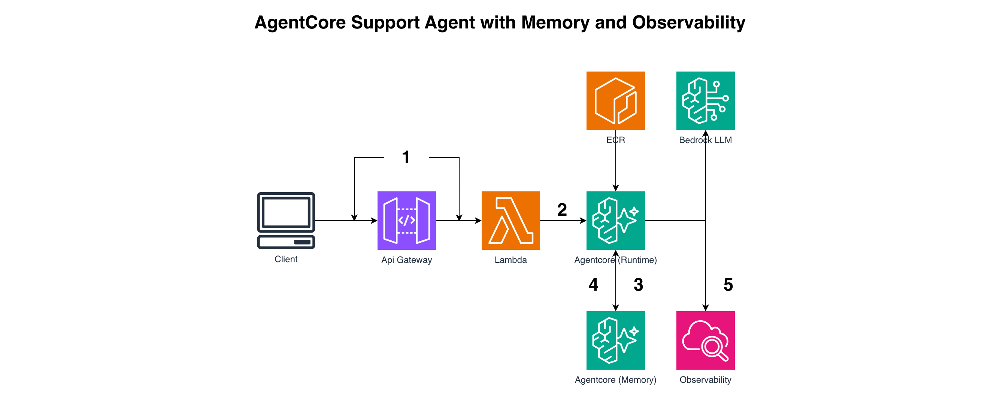
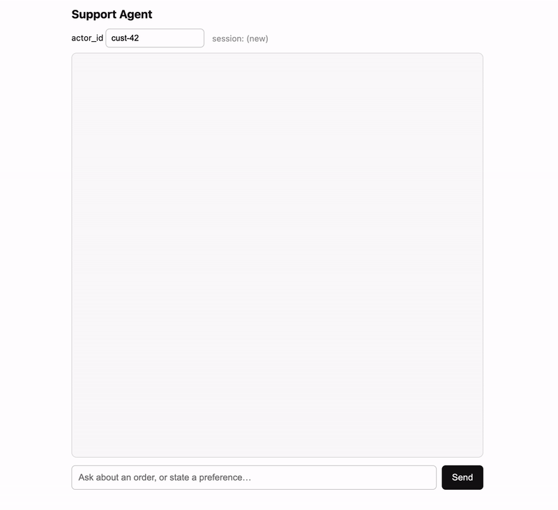

# AgentCore Support Agent — Runtime + Memory + Observability (CDK)

```
User → API Gateway → Lambda (invoker) → AgentCore Runtime (Strands agent)
                                           ├→ Bedrock (model)
                                           ├⇄ AgentCore Memory (short + long term)
                                           └→ Observability (ADOT → CloudWatch GenAI)
```

A Strands customer-support agent on AgentCore Runtime, with AgentCore Memory for
cross-session recall and OpenTelemetry traces flowing to the CloudWatch GenAI
Observability dashboard. Runtime uses default IAM auth — the Lambda's role invokes it.



## Layout

```
Agentcore-Memory-Observibility/
├── app.py
├── agentcore_support_agent/
│   └── agentcore_support_agent_stack.py   # Memory + Runtime + Lambda + API GW
├── agent/                                  # the Strands agent (container → AgentCore Runtime)
│   ├── agent.py                            # BedrockAgentCoreApp + Strands + Memory + trace_attributes
│   ├── requirements.txt                    # strands-agents, bedrock-agentcore, aws-opentelemetry-distro
│   └── Dockerfile                          # arm64, opentelemetry-instrument
└── lambdas/agent_invoker/
    └── agent_invoker.py                          # API GW → invoke_agent_runtime
```

## Prerequisites

- AWS CDK CLI + a recent `aws-cdk-lib` (needs the `aws_bedrockagentcore` L2: Memory, Runtime)
- Docker, AWS creds, bootstrapped account
- **Bedrock model access** enabled for `MODEL_ID` (default `us.anthropic.claude-sonnet-5`)

## 1. Build & push the agent image (arm64!)

AgentCore Runtime requires **linux/arm64**. The stack references an ECR repo `support-agent:latest`.

```bash
REGION=us-east-1
REPO=support-agent
ACCOUNT=$(aws sts get-caller-identity --query Account --output text)
ECR=${ACCOUNT}.dkr.ecr.${REGION}.amazonaws.com

aws ecr create-repository --repository-name "${REPO}" --region "${REGION}"
aws ecr get-login-password --region "${REGION}" | docker login --username AWS --password-stdin "${ECR}"

cd agent
docker buildx build \
  --platform linux/arm64 \
  --provenance=false --sbom=false \
  --output type=image,oci-mediatypes=false,push=true \
  -t "${ECR}/${REPO}:latest" .
cd ..
```

(`--provenance=false ... oci-mediatypes=false` = the Lambda/AgentCore-compatible manifest fix.)

## 2. Deploy

```bash
python -m venv .venv && source .venv/bin/activate
pip install -r requirements.txt
cdk bootstrap
cdk deploy     # Memory creation is async — this step can take 2–3 minutes
```

Outputs: `ChatUrl`, `AgentRuntimeArn`, `MemoryId`.

## 3. Enable observability (once per account)

Traces only reach the CloudWatch GenAI Observability dashboard if **X-Ray Transaction
Search** is enabled. Turn it on in the CloudWatch → Transaction Search (or X-Ray) console
once. After that, the Runtime's ADOT ships traces automatically; the agent tags each span
with `session.id`, so you can group a whole conversation.

## 4. Test — with memory

```bash
URL="<ChatUrl>"

# First turn — state a preference + ask about an order. Note the returned session_id.
curl -s -X POST "$URL" -H 'Content-Type: application/json' \
  -d '{"prompt":"I prefer email over phone. Status of order A1001?","actor_id":"cust-42"}'

# Same session — short-term memory keeps context
curl -s -X POST "$URL" -H 'Content-Type: application/json' \
  -d '{"prompt":"How should you contact me?","actor_id":"cust-42","session_id":"<from above>"}'
```

Long-term recall (preferences/facts) works across *different* sessions for the same
`actor_id`, but extraction is asynchronous — give it ~a minute after the first turn.



## Gotchas

- **AgentCore Runtime requires arm64** images, plus the buildx manifest fix above.
- **Build/push the image BEFORE `cdk deploy`** — the Runtime references the ECR tag.
- **Memory creation is async (2–3 min).** If a deploy fails mid-create, the stack can get
  stuck; you may need `aws bedrock-agentcore-control delete-memory --memory-id <id>` before retry.
  days component (`Duration.days(7)` → 7).
- **Observability needs Transaction Search enabled once** per account, or traces never appear.


## Teardown

```bash
cdk destroy
aws ecr delete-repository --repository-name support-agent --region us-east-1 --force
```