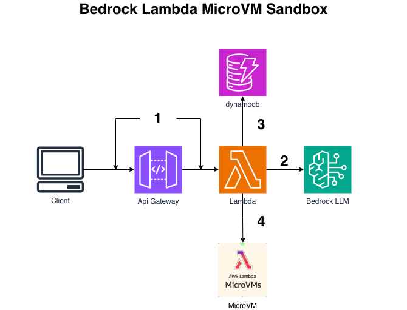
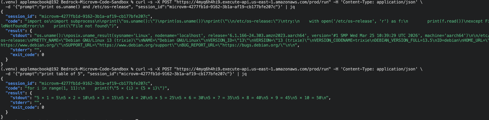

# AI Code Sandbox - Bedrock Writes It, a Lambda MicroVM Runs It (CDK)

```
User → API Gateway → Orchestrator Lambda
                       ├→ Bedrock (writes Python from the prompt)
                       └→ run-microvm → MicroVM sandbox (executes code, isolated)
                          idlePolicy auto-suspends when idle, resumes on the next request
```

The model writes code; instead of `exec()`-ing it in your own process, each session gets
its own Firecracker **MicroVM** (VM-level isolation, Amazon Linux 2023, per-session state).

## Shape: hybrid IaC

Lambda MicroVMs are brand new - there's no CloudFormation resource for the MicroVM
lifecycle yet, and that's fine: a MicroVM is a *runtime* resource, not deploy-time infra.
So **CDK owns the durable pieces** (orchestrator Lambda, API Gateway, DynamoDB session map,
S3 image-bundle bucket, IAM) and the **orchestrator drives the lifecycle** (`run_microvm`,
`create_microvm_auth_token`, `terminate`) per request. The **image** is built by a script.



## Layout
```
├── 5.Bedrock-Microvm-Code-Sandbox
│   ├── app.py
│   ├── bedrock_microvm_code_sandbox
│   │   └── bedrock_microvm_code_sandbox.py # Lambda + API GW + DynamoDB + S3 + IAM
│   ├── lambda_layers
│   │   └── boto3_1_44_43
│   │       └── boto3_1_44_43.zip.          # Latest boto3 for microVM
│   ├── lambdas
│   │   └── orchestrator
│   │       └── orchestrator.py             # Bedrock → run-microvm → POST /execute
│   ├── micro_vm                            # the app baked into the MicroVM image
│   │   ├── Dockerfile
│   │   ├── requirements.txt
│   │   └── server.py                       # /ready /run /suspend /terminate /health /execute
│   ├── microvm-code-sandbox.zip
│   ├── scripts
│   │   ├── build_image.sh                  # zip → S3 → create-microvm-image → wire ARN into Lambda
│   │   └── teardown.sh
```

## Deploy (two phases)

```bash
python -m venv .venv && source .venv/bin/activate
pip install -r requirements.txt
cdk bootstrap
cdk deploy                      # phase 1 - durable infra
```

Outputs: `RunUrl`, `BundleBucketName`, `OrchestratorFunction`, `MicrovmExecutionRoleArn`.

```bash
# phase 2 - build the MicroVM image and point the orchestrator at it
MicrovmExecutionRoleArn=<role arn> \
BUNDLE_BUCKET=<BundleBucketName> \
ORCH_FN=<OrchestratorFunction> \
./scripts/build_image.sh
```

## Test

```bash
curl -s -X POST "<RunUrl>" -H 'Content-Type: application/json' \
  -d '{"prompt":"compute the first 15 Fibonacci numbers"}' | jq

# prove VM isolation + persistent state (reuse the returned session_id):
curl -s -X POST "<RunUrl>" -H 'Content-Type: application/json' \
  -d '{"prompt":"print os.uname() and the contents of /etc/os-release","session_id":"<id>"}' | jq
curl -s -X POST "<RunUrl>" -H 'Content-Type: application/json' \
  -d '{"prompt":"write the current time to /workspace/state.txt","session_id":"<id>"}' | jq
# wait past the idle window, then:
curl -s -X POST "<RunUrl>" -H 'Content-Type: application/json' \
  -d '{"prompt":"read and print /workspace/state.txt","session_id":"<id>"}' | jq
```



## Teardown

```bash
./scripts/teardown.sh
```