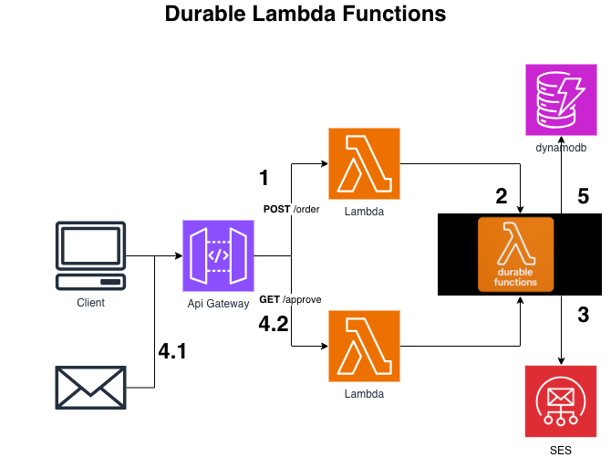

# Durable Order Approval — Human-in-the-Loop with Lambda Durable Functions (CDK)

```
POST /orders → Starter Lambda ──async──▶ Durable order fn
                                            step: save PENDING → DynamoDB
                                            create_callback + step: SES approval email
                                            callback.result()  ← suspends (no compute)
GET /approve → Completer Lambda → SendDurableExecutionCallbackSuccess → fn resumes
                                            step: update APPROVED/REJECTED → DynamoDB
```

An order that pauses for a human "approve/reject" — without a Step Functions state
machine and without paying for idle compute while it waits. The pause is a single
`callback.result()` in ordinary sequential Python.


## Layout

```
durable-order-approval/
├── durable_lambda_order_approval_stack/…_stack.py   # DynamoDB + 3 Lambdas + API GW (durable_config)
├── lambdas/
│   ├── order_fn/order_fn.py            # the DURABLE function (steps + callback)
│   ├── starter/starter.py              # POST /orders → async-invoke the durable fn
│   └── completer/completer.py          # GET /approve → complete the callback
└── scripts/layer_builder.sh            # build SDK layer for durable lambda
```

## Deploy

```bash
python -m venv .venv && source .venv/bin/activate
pip install -r requirements.txt

# SES sender must be a verified identity (and in the SES sandbox, the recipient too)
export SENDER_EMAIL="you@verified.example.com"
cdk bootstrap
cdk deploy
```

Outputs: `OrdersUrl`, `ApproveUrl`, `OrdersTable`.

## Test

```bash
# 1. place an order — returns immediately with an order_id (workflow runs in background)
curl -s -X POST "<OrdersUrl>" -H 'Content-Type: application/json' \
  -d '{"item":"Standing desk","amount":420,"customer_email":"you@verified.example.com"}'
# → {"order_id":"…","status":"PENDING_APPROVAL"}

# 2. check the item in DynamoDB — status is PENDING_APPROVAL; the durable fn is SUSPENDED
aws dynamodb get-item --table-name <OrdersTable> \
  --key '{"order_id":{"S":"<order_id>"}}'

# 3. click the Approve link in the email (or curl it) — the durable fn RESUMES
curl -s "<ApproveUrl>?cb=<callback_id_from_email>&decision=approve"

# 4. DynamoDB status is now APPROVED. During the whole wait you paid nothing.
```

Watch the whole thing in the Lambda console's **Durable Executions** tab — you'll see
`CallbackStarted → InvocationCompleted` (suspended), then a resume after the click.

## Gotchas

- **Determinism**: the handler replays from the top on resume. Every side effect (DynamoDB,
  SES) lives inside a `@durable_step`, and the `order_id` is generated in the *starter*, not
  the durable handler. Never call `random`/`time`/APIs outside a step.
- **`ExecutionTimeout` ≠ `Timeout`**: `Timeout` (≤15 min) is per invocation; `ExecutionTimeout`
  (here 2 days, up to 1 year) is the whole workflow including the wait.
- **Async start**: the starter invokes the durable fn with `InvocationType=Event`, so the API
  returns 202 immediately — the workflow suspends for approval in the background.
- **Versioning (prod)**: best practice is to invoke a version/alias, not `$LATEST`, so code
  changes mid-wait don't break replay. This demo invokes the function directly for simplicity.
- **SES sandbox**: verify the sender (and recipient, in sandbox) or `send_email` fails.
- **Verify the callback API** (`send_durable_execution_callback_success` + the IAM action names)
  against your botocore/SDK version — it's a brand-new API.

## Teardown

```bash
cdk destroy
```