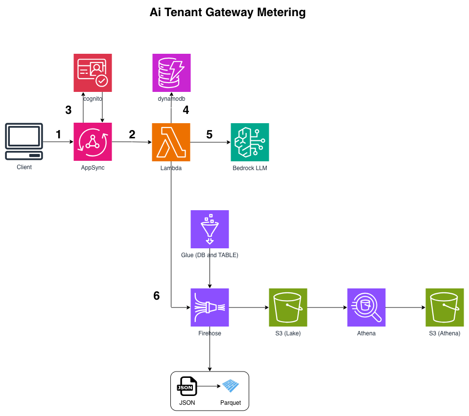

# AI Gateway - Per-Tenant Token Metering + Cost Control (CDK)

```
Client ⇄ AppSync Events (WebSocket, managed fan-out)
           → Lambda (chat handler)
              ├→ Cognito JWT (sub → user_id)
              ├⇄ DynamoDB (atomic ADD token counters, TTL) → limit check / 429
              ├→ Bedrock Converse (stream tokens back over AppSync)
              └→ Firehose → S3 (Parquet, partitioned) → Glue → Athena (usage/cost SQL)
```

Multi-tenant AI chat: tokens pushed to the client in real time, per-tenant budgets enforced
*before* the model call, and every request landing in a queryable usage/cost lake.


## How the "streaming" works (important)

The Lambda **never returns an HTTP response to the browser**. It's the `onPublish` handler,
invoked with `InvokeType: EVENT` (async), so the client's publish is acked immediately.
As Bedrock produces deltas, the Lambda **publishes them as events**; AppSync pushes each one
down the client's WebSocket subscription.

```
Response streaming (chunked HTTP body):  Lambda → HTTP body → client
This project (pub/sub push):             Lambda → publish → AppSync → WebSocket → client
```

Same token-by-token UX, different transport - you get managed fan-out and no long-lived
HTTP request.

## Channels

- Publish prompt → `/chat/{user_id}/prompt` → triggers the Lambda
- Subscribe → `/chat/{user_id}/stream` → receives `token` / `done` / `error` events

## Deploy

```bash
python -m venv .venv && source .venv/bin/activate
pip install -r requirements.txt
cdk bootstrap
cdk deploy
```

Enable Bedrock model access for `MODEL_ID` first. Tune `MONTHLY_TOKEN_LIMIT` (default 100k).

## Test it (the easy way)

```bash
./scripts/setup_user.sh          # creates a Cognito user, authenticates, writes web/config.js
open web/test.html               # or serve it: python3 -m http.server -d web 8000
```

`setup_user.sh` reads the stack outputs, creates the user, sets a permanent password, decodes
the JWT to get the `sub` (the tenant id), and writes `web/config.js` so `test.html` is
pre-filled. Click **Connect**, send a prompt, and watch tokens stream in - then a footer:

```
✓ in 12 / out 240 tokens · $0.000964 · 99748 tokens remaining
```

**Demo the 429**: redeploy with `MONTHLY_TOKEN_LIMIT = "200"`, send two prompts - the second
comes back as `[429] Monthly token limit reached.` (Bedrock is never called.)

The ID token expires in ~1 hour; re-run the script for a fresh one.

## Verify the metering

```bash
# per-tenant counters - immediate (this is what enforcement reads)
aws dynamodb get-item --table-name <UsageTable> \
  --key '{"user_id":{"S":"<sub>"},"period":{"S":"2026-07"}}'
```

```bash
# usage lake - after the ~60s Firehose buffer. MUST pass --work-group.
aws athena start-query-execution \
  --work-group <slug>-wg \
  --query-string "SELECT user_id, SUM(total_tokens) tokens, ROUND(SUM(cost_usd),6) cost_usd, COUNT(*) reqs FROM <slug_db>.usage GROUP BY user_id ORDER BY cost_usd DESC" \
  --region us-east-1

aws athena get-query-results --query-execution-id <id> --region us-east-1
```

In the **Athena console**, switch the workgroup dropdown from `primary` to `<slug>-wg` -
otherwise you get *"No output location provided"*, because `primary` has none.

## Gotchas

- **Infinite-loop guard**: the handler fires on *every* publish in the namespace - including its
  own `/stream` token events. It returns early unless the channel ends in `/prompt`. Remove that
  guard and each token re-invokes the Lambda → runaway recursion (and bill).
- **`InvokeType: EVENT`** (async) is required. `REQUEST_RESPONSE` makes the publisher wait for the
  whole generation and times out.
- **Atomic `ADD`** on the DynamoDB counter - read-modify-write loses increments under concurrency
  and lets tenants exceed their cap.
- **AppSync caps publishes at 5 events per call** - token deltas are batched accordingly. Drop the
  batch to 1 for visibly smoother streaming (at 5× the publish calls).
- **Firehose buffers (~60s)** - Athena is not real-time. Enforcement reads DynamoDB (immediate);
  Athena is for analytics/billing.
- **Athena workgroup**: pass `--work-group` (CLI) or select it (console), or Athena falls back to
  `primary` and errors with no output location. The stack sets
  `enforce_work_group_configuration=True`.
- **Athena partitions**: data lands under `usage/dt=YYYY-MM-DD/`. Run `MSCK REPAIR TABLE <db>.usage`
  (or add partition projection) so Athena sees new days.
- **`ROUND(cost_usd, 2)` shows 0.0** for cheap models - use 6 decimals.
- **Tenant id comes from the verified JWT `sub`**, never a client-supplied field.

## Teardown

```bash
cdk destroy
```