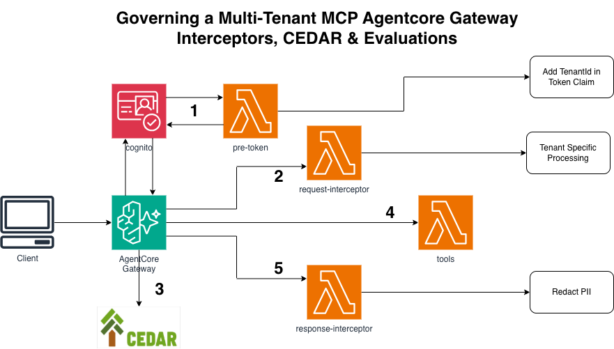
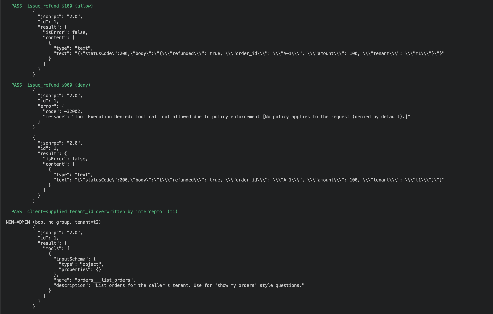

# Governed Multi-Tenant MCP Gateway (v2 of the Lambda-as-MCP-tool build)

```
User → AgentCore Gateway
         ├→ [1] Pre-Token Trigger    : enrich the ACCESS token with tenant + role (Cognito, at login)
         ├→ [2] Request Interceptor  : inject the trusted tenant into every tool call
         ├→ [3] Cedar Policy Engine  : allow/deny InvokeTool  (default-deny, forbid-wins)
         ├→ [4] Lambda target        : the tools
         └→ [5] Response Interceptor : filter ListTools by role + redact PII
                 → AgentCore Evaluations → CloudWatch (correctness, tool-selection, safety)
```


Project #1 exposed a Lambda as an MCP tool. This adds the governance layer you need before
more than one tenant touches it.

## The ordering that matters

**Layer 1 runs once, at login. Layers 2–5 run on every call.** The pre-token trigger fires
when Cognito mints a token, not when a tool is invoked. It's the only place that can change
what the *token* contains — and Cedar builds `principal` from the token, so it's upstream of
everything else.

**The Gateway runs the request interceptor BEFORE Cedar.** That's the per-call design: the
interceptor *enriches* (injects the trusted `tenant_id` from the verified JWT), and Cedar
then *decides* deterministically. Enforcement is never left to the LLM, and prompt injection
can't argue with Cedar.

**ListTools filtering is response-side** — the Gateway fetches the tool list, then the
response interceptor strips tools the caller may not see. This is attack-surface reduction,
not access control: nothing stops a client calling a hidden tool by name, and Cedar is what
denies it.

## What's governed

- `list_orders` — any authenticated user with a `custom:tenant_id` claim; scoped to their own
  tenant (interceptor-injected, filtered in the tool).
- `issue_refund` — **admins only, under $500** (Cedar), and hidden from non-admins' tool list
  (response interceptor). PII in tool output is redacted on the way back.

Cedar gates *whether the call happens*; it cannot scope the rows that come back. Tenant
isolation is enforced in the tool, on the interceptor-injected `tenant_id` — make it the
partition key so a cross-tenant read is unexpressible rather than merely filtered out.


## Deploy

```bash
python -m venv .venv && source .venv/bin/activate
pip install -r requirements.txt
cdk bootstrap && cdk deploy
```

Outputs: `GatewayUrl`, `GatewayArn`, `UserPoolId`, `PublicClientId`, `M2MClientId`,
`PolicyEngineId`.

Deploy with `mode="LOG_ONLY"` in the policy-engine configuration first, confirm the
decisions, then flip to `"ENFORCE"` and redeploy.

## Test

```bash
./scripts/test-gateway.sh
```

Creates two users (admin/t1 and user/t2), fetches tokens, asserts the token claims arrived,
and checks the full matrix:

| | admin, t1 | user, t2 |
|---|---|---|
| sees `issue_refund` in `tools/list` | yes | no |
| `list_orders` | allow | allow |
| `issue_refund` $100 | allow | deny |
| `issue_refund` $900 | deny | deny |




## Teardown

```bash
cdk destroy
```