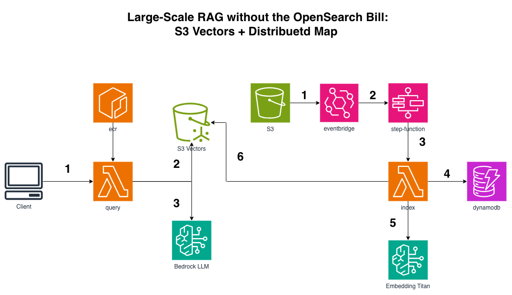
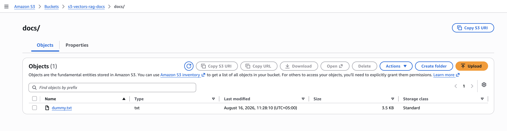
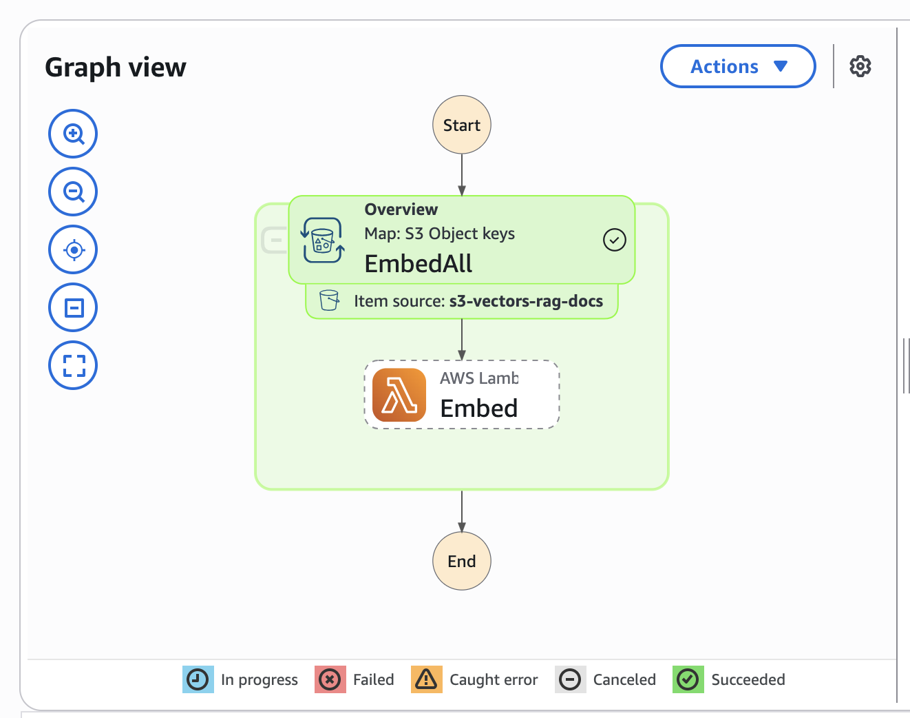
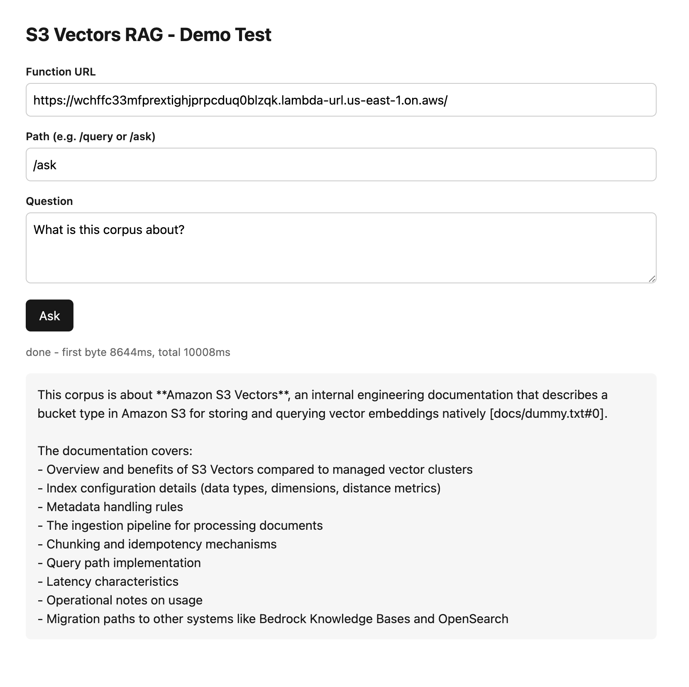

# Billion-Scale RAG on S3 Vectors (no OpenSearch bill)



```
Ingest:  S3 (docs) → EventBridge → Step Functions Distributed Map (S3 ItemReader)
                   → Lambda ⇄ DynamoDB ledger → Titan Embed v2 → S3 Vectors (PutVectors)

Query:   Client → Function URL (stream) → Lambda (FastAPI + LWA)
                → S3 Vectors (kNN) → Bedrock (answer, streamed with citations)
```

The vector store is **S3 Vectors** - native CloudFormation (`AWS::S3Vectors::VectorBucket` + `AWS::S3Vectors::Index`), no cluster, no node-hours, nothing running when idle.

## Deploy

**1. Build + push the query image** (FastAPI + Web Adapter, streams the answer):

```bash
REGION=us-east-1; REPO=s3-vectors-rag-query
ACCOUNT=$(aws sts get-caller-identity --query Account --output text)
ECR=${ACCOUNT}.dkr.ecr.${REGION}.amazonaws.com

aws ecr create-repository --repository-name "${REPO}" --region "${REGION}"

docker logout public.ecr.aws
aws ecr-public get-login-password --region us-east-1 | docker login --username AWS --password-stdin public.ecr.aws
aws ecr get-login-password --region "${REGION}" | docker login --username AWS --password-stdin "${ECR}"

cd lambdas/query
docker buildx build --provenance=false --sbom=false \
  --output type=image,oci-mediatypes=false,push=true \
  -t "${ECR}/${REPO}:latest" .
cd ../..
```

**2. Deploy:**

```bash
python -m venv .venv && source .venv/bin/activate
pip install -r requirements.txt
cdk bootstrap && cdk deploy
```

Enable Bedrock access for `amazon.titan-embed-text-v2:0` and your chat model first.

## Use it

```bash
# ingest: drop docs under the docs/ prefix - EventBridge starts the Distributed Map
aws s3 cp ./mydocs/ s3://<DocsBucket>/docs/ --recursive

# query (streams, with [file#chunk] citations)
curl -N -X POST "<QueryUrl>ask" -H 'Content-Type: application/json' \
  -d '{"question":"What is our refund policy?"}'
```

Watch the Step Functions console: the Distributed Map fans out one child execution per
object, up to 1000 concurrent.

## Why Distributed Map (and not a glue Lambda)

The Map's `ItemReader` points straight at the S3 prefix (`s3:listObjectsV2`), so Step
Functions lists the objects itself. That means **no Lambda listing keys**, and no 256KB
state-payload ceiling - the classic blocker when you try to pass a big key list between
states. It scales to millions of objects with 10k concurrent children.

## See it working

The whole flow is three screenshots, and each one shows a different part of the claim.

**1  Drop a file in the bucket.** Nothing else. No API call, no "start ingestion" button. The bucket has `event_bridge_enabled=True`, so the upload itself is the trigger.



**2  The Distributed Map fans out.** EventBridge started the state machine with `{"prefix": "docs/"}`, and the `ItemReader` listed the prefix straight from S3  no glue Lambda in the graph, because there isn't one. Each object is its own child execution with its own retry budget, so a single malformed file shows up as one red child instead of a failed run. Open a child that ran against an already-embedded document and you'll see it exit in milliseconds: ledger hit, no Bedrock call, no spend.



**3  Ask a question.** The Function URL streams the answer back token by token, with `[file#chunk]` citations pulled from the vector metadata  so every claim points at the exact chunk it came from, and you can go read it.



Worth stating plainly what *isn't* in any of these screenshots: no cluster, no node count, no shard strategy, no OCU commitment. Between uploads and questions, the vector store costs storage and nothing else.

## Gotchas

- **float32 is required.** Titan returns doubles; cast before `put_vectors` or the SDK
  silently converts (and other SDKs may not).
- **Dimension must match the model exactly** - Titan Text Embeddings V2 = **1024**. Set it at
  index creation; you cannot change it later without rebuilding the index.
- **Use the same embedding model for query and ingest.** Different model = meaningless kNN.
- **`raw_text` is non-filterable metadata.** Filterable keys cost more and are capped - keep
  the chunk text out of the filterable set (it's still returned via `returnMetadata`).
- **Vector keys are your idempotency.** `"{key}#{chunk}"` means re-ingesting a document
  overwrites its chunks instead of duplicating them.
- **PutVectors is batched** - chunk your writes (100/call here) rather than one call per vector.
- **S3 Vectors is sub-second, not sub-millisecond.** It trades a little latency for ~90% less
  cost than a provisioned cluster. If you need single-digit-ms p99 at high QPS, that's still
  OpenSearch territory.
- **Console can't query vectors** - insert/query are SDK/CLI only.

## Teardown

```bash
cdk destroy
aws ecr delete-repository --repository-name s3-vectors-rag-query --region us-east-1 --force
```