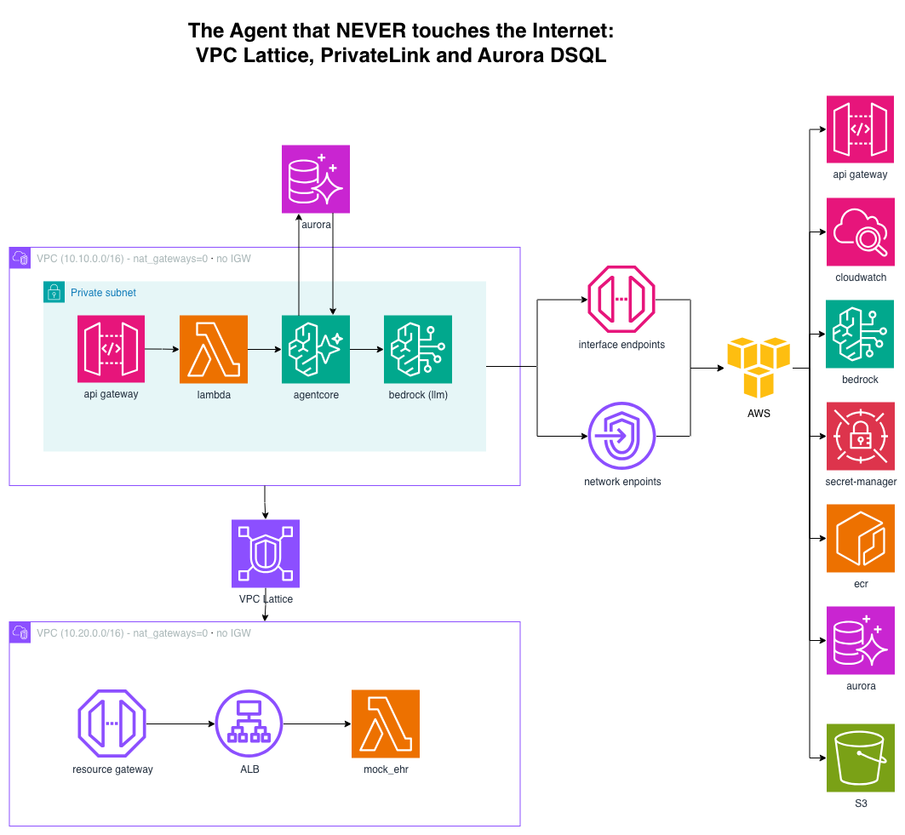
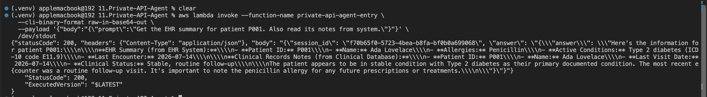

# Private-API Agent - VPC Lattice, PrivateLink, Aurora DSQL (no internet)



```
User → API Gateway (PRIVATE) → Lambda (in VPC)
  → AgentCore Runtime (in VPC, ENI in your subnets)
     ├→ Bedrock (interface VPC endpoint - not the public API)
     ├→ internal EHR/ERP in a SEPARATE VPC via VPC Lattice (no NAT, no peering)
     └⇄ Aurora DSQL (IAM auth - no password, no connection pooler)

All traffic stays inside the VPC → CloudWatch + CloudTrail audit
```

**Zero NAT gateways. Zero internet gateways.** Verified in the synthesized template.
This is the shape compliance teams (healthcare, finance) actually ask for.

## Deploy

### 1. Build + push the agent image (arm64)

```bash
REGION=us-east-1; REPO=private-api-agent-agent
ACCOUNT=$(aws sts get-caller-identity --query Account --output text)
ECR=${ACCOUNT}.dkr.ecr.${REGION}.amazonaws.com
aws ecr create-repository --repository-name "${REPO}" --region "${REGION}"
aws ecr get-login-password --region "${REGION}" | docker login --username AWS --password-stdin "${ECR}"
aws ecr-public get-login-password --region us-east-1 | docker login --username AWS --password-stdin public.ecr.aws
cd agent
docker buildx build --platform linux/arm64 --provenance=false --sbom=false \
  --output type=image,oci-mediatypes=false,push=true -t "${ECR}/${REPO}:latest" .
cd ..
```

AgentCore Runtime is arm64 only. `--platform linux/arm64` on the build command is what
guarantees it, regardless of the machine you build on. The stack reads the `latest` tag -
if you tag differently, update `from_ecr_repository(repo, ...)` to match.

### 2. Pass 1 - create everything

```bash
cdk bootstrap && cdk deploy PrivateApiAgentStack
```

Values AWS assigns at create time are **not** CloudFormation attributes, so the agent
can't be wired up in a single pass. Both lookup commands are emitted as stack outputs
(`EhrDnsLookupCmd`, `DsqlVpceLookupCmd`):

```bash
# → ehr_host
aws vpc-lattice get-service-network-resource-association \
  --service-network-resource-association-identifier <snra-id> \
  --query dnsEntry.domainName --output text

# → dsql_vpce_service_name   (its own API, NOT a field on `dsql get-cluster`)
aws dsql get-vpc-endpoint-service-name --identifier <cluster-id> \
  --query serviceName --output text
```

### 3. Pass 2 - wire it in

```bash
cdk deploy PrivateApiAgentStack \
  -c ehr_host=snra-xxxx.rcfg-xxxx.xxxxxxx.vpc-lattice-rsc.us-east-1.on.aws \
  -c dsql_vpce_service_name=com.amazonaws.us-east-1.dsql-xxxx
```

This creates the DSQL connection endpoint. Its private DNS name is a *third*
AWS-assigned value, read back with the `DsqlPrivateHostHint` output:

```bash
aws ec2 describe-vpc-endpoints --vpc-endpoint-ids <vpce-id> \
  --query 'VpcEndpoints[0].DnsEntries[*].DnsName' --output text
```

The endpoint provisions a wildcard record, `*.dsql-xxxx.<region>.on.aws`, so
`<cluster-id>.dsql-xxxx.<region>.on.aws` resolves inside the VPC.

### 4. Pass 3 - schema bootstrap

```bash
./build_layer.sh          # psycopg layer; must run before deploy
cdk deploy PrivateApiAgentStack \
  -c ehr_host=... -c dsql_vpce_service_name=... \
  -c dsql_private_host=<cluster-id>.dsql-xxxx.us-east-1.on.aws
```

Only on this pass do the `DbInit` Lambda and its `DsqlSchema` custom resource come into
existence. They create the `patients` table and seed three rows. The gate is deliberate:
created any earlier, `DbInit` fires against a hostname that doesn't resolve yet.

## Test

Fast path - invoke the entry Lambda directly. Exercises the agent, Bedrock, the
cross-VPC Lattice call, and DSQL:

```bash
aws lambda invoke --function-name private-api-agent-entry \
  --cli-binary-format raw-in-base64-out \
  --payload '{"body":"{\"prompt\":\"Get the EHR summary for patient P001. Also read its notes from system.\"}"}' \
  /dev/stdout
```

Both tools have to fire for this to be a real test.




Full path - a PRIVATE API is not reachable from your laptop, which is the point. SSM into
a bastion in the app VPC and:

```bash
curl -s -X POST "https://<api-id>.execute-api.us-east-1.amazonaws.com/prod/ask" \
  -H 'Content-Type: application/json' \
  -d '{"prompt":"Summarize the last visit for patient P001"}'
```

From outside the VPC you'll get a timeout or 403 - proof the boundary works.

**Negative test.** The stack outputs `EhrAlbDnsName` on purpose. From inside the app VPC
that hostname must not resolve to anything reachable. If it does, you have peering you
forgot about and Lattice isn't doing the work you think it is.

## The private hops

| Hop | How it stays private |
|---|---|
| Client → API GW | `PRIVATE` endpoint + resource policy restricting `aws:SourceVpce` |
| Lambda → Runtime | Both have ENIs in your private subnets |
| Agent → Bedrock | Interface VPC endpoint (`bedrock-runtime`), not the public API |
| Agent → EHR | Lattice resource configuration in a separate VPC, reached via service network association |
| Agent → DSQL | Per-cluster connection endpoint + IAM auth token; no password anywhere |


## Teardown

```bash
cdk destroy PrivateApiAgentStack
aws ecr delete-repository --repository-name private-api-agent-agent --region us-east-1 --force
```

### NOTE: 
it can take some time to destroy the resources (it will fail for first call). The Endpoint created by Agentcore will be destroyed after 8 hours. So you have to call the destroy command again (or you can use console)
