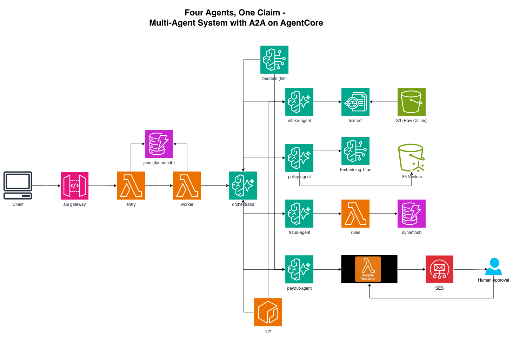
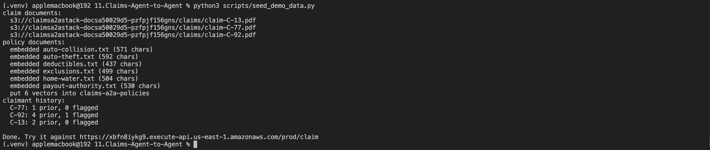
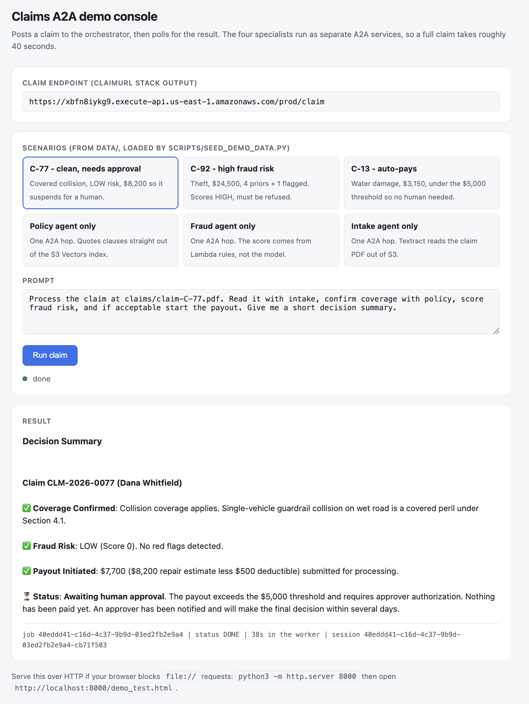
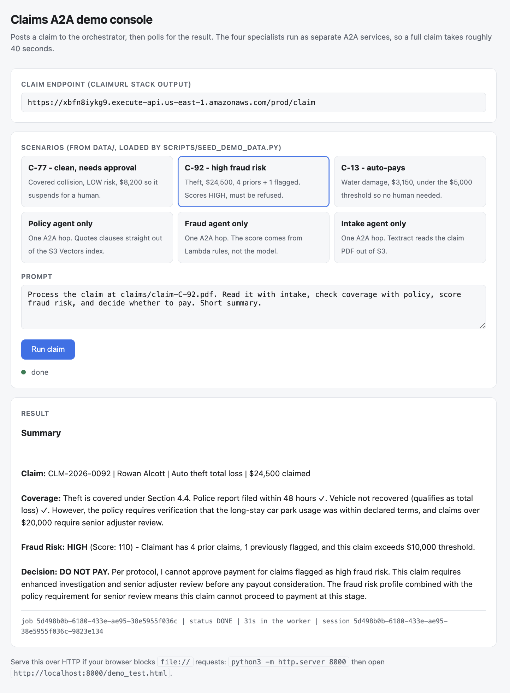
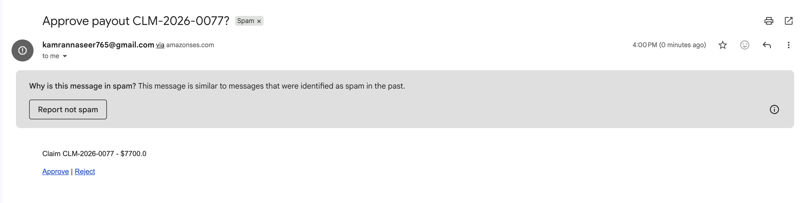
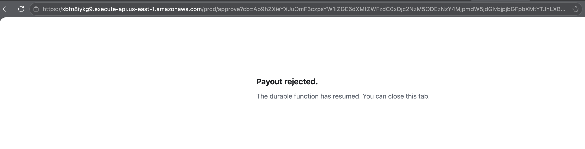

# Multi-Agent A2A Claims System


```
User → API GW → Entry Lambda ──(202 job_id)──> client polls GET /claim/{job_id}
                     │
                     └─async→ Worker Lambda → Orchestrator Agent (AgentCore Runtime, HTTP)
                                                ├─A2A→ Intake Agent  → Textract → S3
                                                ├─A2A→ Policy Agent  → S3 Vectors (policy docs)
                                                ├─A2A→ Fraud Agent   → Lambda → DynamoDB (rules/history)
                                                └─A2A→ Payout Agent  → Lambda (durable fn) → human approval → SES
                                              → AgentCore Evaluations → CloudWatch
```

Four specialist agents as independent **A2A servers**, one orchestrator that delegates to them.
This build composes four earlier projects (S3 Vectors RAG, durable functions, AgentCore
Observability, Evaluations).

## Layout

```
agents/
  orchestrator/   main.py  requirements.txt  Dockerfile   → BedrockAgentCoreApp on :8080
  intake/         main.py  requirements.txt  Dockerfile   → Strands A2AServer on :9000
  policy/  fraud/  payout/                                → Strands A2AServer on :9000
lambdas/
  entry/          POST /claim (dispatch) + GET /claim/{job_id} (poll)
  worker/         runs the ~45s agent flow behind an async invoke
  fraud/          deterministic fraud rules
  payout/         durable function, suspends for human approval
data/
  claims/*.pdf    three sample claim forms (Textract input)
  policies/*.txt  six policy clauses for the S3 Vectors index
  claimants.json  claim histories the fraud rules read
scripts/
  build_agents_codebuild.sh  [all|<agent>] [tag]   build on CodeBuild (arm64 native)
  build_agents.sh            [all|<agent>] [tag]   build locally (needs an arm64 host)
  seed_demo_data.py                                load data/ into the deployed stack
  make_sample_claims.py                            regenerate data/claims/*.pdf
buildspec.yml     builds all five images on Graviton
demo_test.html    browser console for driving the API
.image-tags       tag per agent, written by the build
```

Each `agents/` folder is a **separate service**: its own image, its own ECR repo
(`claims-a2a-<name>`), its own dependencies, its own IAM role, its own deploy. The specialists
run a Strands `A2AServer` on **port 9000** (AgentCore's A2A contract, agent card at
`/.well-known/agent-card.json`); the orchestrator runs `BedrockAgentCoreApp` on 8080 and
reaches each peer with a JSON-RPC `message/send` through `InvokeAgentRuntime`.

## Deploy

AgentCore Runtime is **arm64 only**. On an x86 host `docker buildx` has to emulate arm64
through QEMU, which turns one `pip install` into a 40-minute step, so the default path builds
on CodeBuild's Graviton compute:

```bash
# 1. create the repos + build/push all five images on Graviton
./scripts/build_agents_codebuild.sh all 1

# 2. deploy (SES sender must be verified)
SENDER_EMAIL=you@verified.example.com cdk deploy

# 3. load the demo fixtures (claims to S3, policies to S3 Vectors, histories to DynamoDB)
python3 scripts/seed_demo_data.py
```

`aws_durable_execution_sdk_python` reaches the payout function through
`layers/durable-sdk-layer.zip`, so the handler asset stays at two files. Rebuild the layer with
`pip install -r lambdas/payout/requirements.txt -t python/ && zip -r layers/durable-sdk-layer.zip python/`
if you need a newer SDK.

The build script records what it pushed in `.image-tags`, and the stack reads it, so
`cdk deploy` uses the tag you just built. Precedence is `IMAGE_TAG_<AGENT>` env, then
`IMAGE_TAG` env, then `.image-tags`, then `latest`.

Measured here: **106 billable seconds for all five images** (6s provisioning, 12s pre-build,
87s build) - inside CodeBuild's free tier of 100 arm1.small minutes/month. The same work
emulated on an x86 laptop took 44 minutes for *one* image.

If you are already on arm64 hardware, `./scripts/build_agents.sh all 1` builds locally instead.

## Test

The agent flow takes about 45 seconds, past API Gateway's 29-second integration ceiling, so
the API is asynchronous: `POST` returns a job id, then you poll.

```bash
CLAIM_URL=$(aws cloudformation describe-stacks --stack-name ClaimsA2AStack \
  --query "Stacks[0].Outputs[?OutputKey=='ClaimUrl'].OutputValue" --output text)

JOB=$(curl -s -X POST "$CLAIM_URL" -H 'Content-Type: application/json' \
  -d '{"prompt":"Process the claim at claims/claim-C-77.pdf. Read it with intake, confirm coverage with policy, score fraud risk, and if acceptable start the payout."}' \
  | python3 -c 'import json,sys; print(json.load(sys.stdin)["job_id"])')

curl -s "$CLAIM_URL/$JOB" | python3 -m json.tool     # repeat until status is DONE
```

Or open **`demo_test.html`** in a browser, paste the `ClaimUrl`, and pick a scenario. It does
the POST-then-poll for you and shows elapsed time. If your browser blocks `file://` fetches,
serve it: `python3 -m http.server 8000`.

### The three seeded scenarios

| Claim | Amount | History | What it exercises |
| --- | --- | --- | --- |
| `claim-C-77.pdf` | $8,200 | 1 prior, 0 flagged | Covered collision, fraud LOW, over the $5,000 threshold so the durable payout **suspends** and emails an approval link |
| `claim-C-92.pdf` | $24,500 | 4 prior, 1 flagged | Theft. Fraud scores **HIGH (110)** and the orchestrator refuses to pay |
| `claim-C-13.pdf` | $3,150 | 2 prior, 0 flagged | Water damage, fraud LOW, under the threshold so it **auto-pays** and writes `PAID` |

Verified end to end: C-77 settles at $7,700 ($8,200 less the $500 deductible), C-92 is
declined on the fraud flag, C-13 auto-pays $2,900. Scores are reproducible - C-77 is LOW 0 and
C-92 is HIGH 110 on every run, because scoring is a pure read and the agents run at
`temperature=0`. If your numbers differ, reseed.







## Teardown

```bash
cdk destroy
for AGENT in orchestrator intake policy fraud payout; do
  aws ecr delete-repository --repository-name "claims-a2a-${AGENT}" --region us-east-1 --force
done

# build infrastructure (only if you used the CodeBuild path)
aws codebuild delete-project --name claims-a2a-agent-builder --region us-east-1
aws iam delete-role-policy --role-name claims-a2a-codebuild-role --policy-name claims-a2a-codebuild-policy
aws iam delete-role --role-name claims-a2a-codebuild-role
aws s3 rb "s3://claims-a2a-codebuild-src-$(aws sts get-caller-identity --query Account --output text)-us-east-1" --force
```
