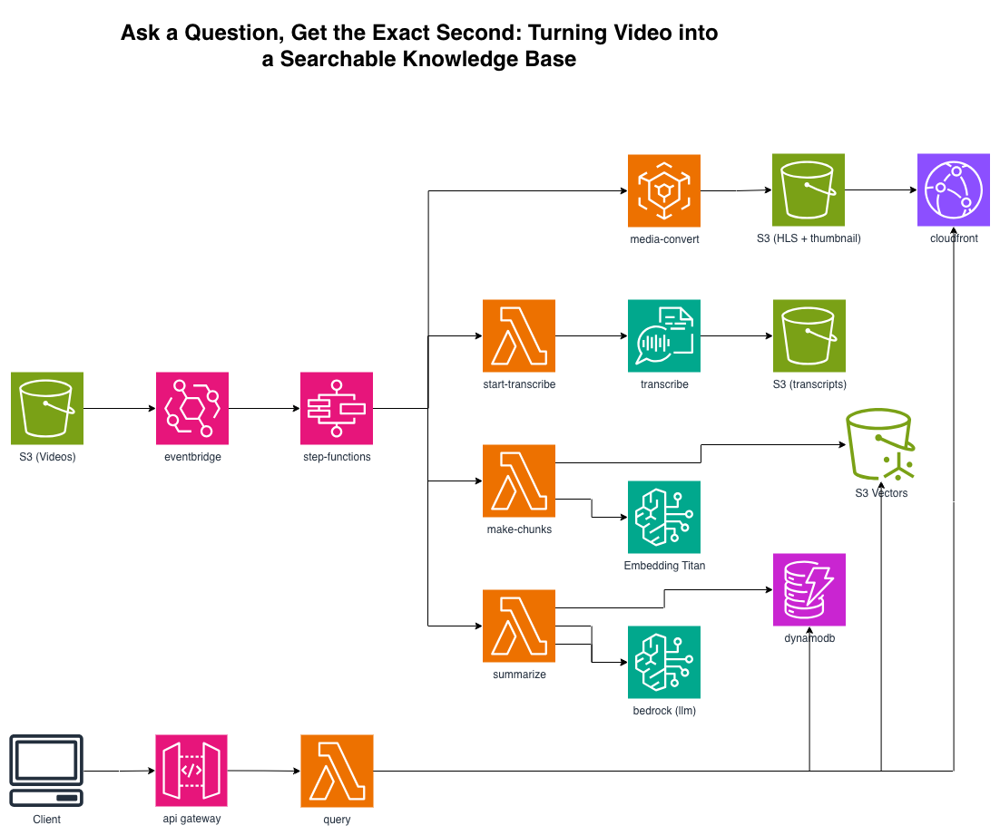
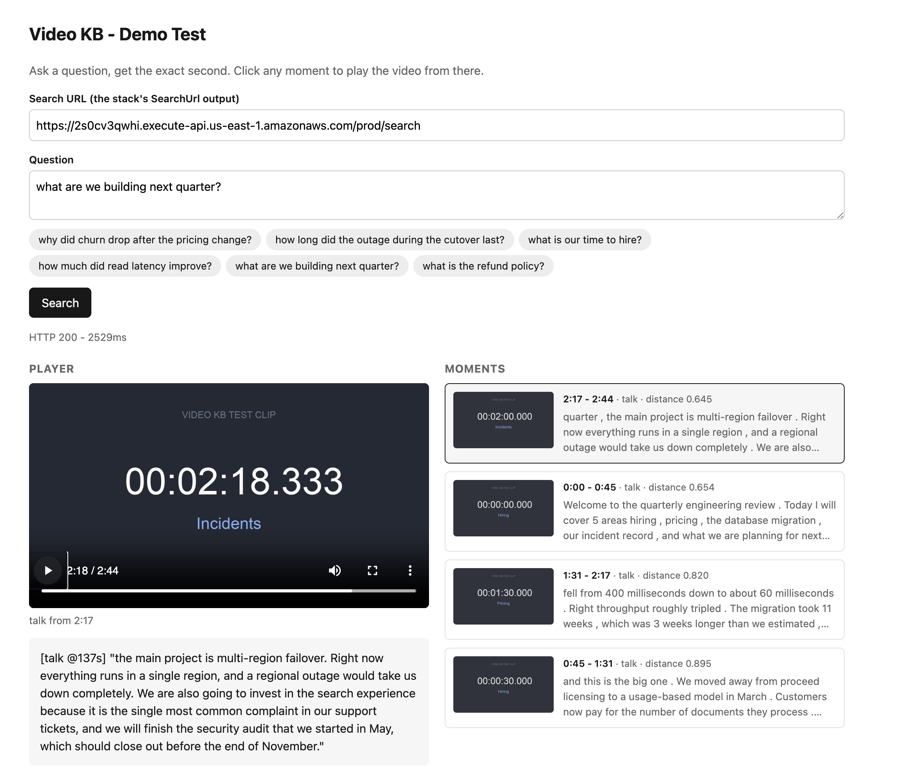

# Serverless Video → Searchable Knowledge Base



```
S3 (video) → EventBridge → Step Functions
   ├→ MediaConvert (HLS + thumbnails) → S3 → CloudFront
   ├→ Transcribe (transcript + speaker labels) → S3
   ├→ Distributed Map (chunks) → Titan Embed → S3 Vectors
   └→ Bedrock (chapters + summary) → DynamoDB

Query: Client → API GW → Lambda → S3 Vectors → timestamped clip + CloudFront URL
```

Ask a question in English; get back the **exact moment** in the video that answers it,
as a playable deep link.

## The core idea

Every vector carries its **start/end timestamp** as metadata:

```python
"metadata": {"video_id": ..., "start": 412.5, "end": 457.5, "raw_text": chunk}
```

So a semantic hit resolves to a moment, not just to text - and the query Lambda turns it
straight into `https://<cdn>/<video_id>/hls.m3u8#t=412`.

## Deploy

```bash
python -m venv .venv && source .venv/bin/activate
pip install -r requirements.txt
cdk bootstrap && cdk deploy
```

Enable Bedrock access for `amazon.titan-embed-text-v2:0` and your chat model.

## Use it

```bash
# ingest - the prefix matters (the EventBridge rule listens on videos/)
aws s3 cp talk.mp4 s3://<MediaBucket>/videos/talk.mp4

# watch the pipeline in the Step Functions console (transcode ∥ transcribe run in parallel)

# search
curl -s -X POST "<SearchUrl>" -H 'Content-Type: application/json' \
  -d '{"question":"what did they say about pricing?"}' | jq
```

```json
{
  "answer": "They discussed usage-based pricing [talk @412s]...",
  "moments": [{
    "video_id": "talk", "start": 412, "end": 457,
    "clip_url": "https://d123.cloudfront.net/talk/hls.m3u8#t=412",
    "thumbnail": "https://d123.cloudfront.net/talk/thumb.0000013.jpg",
    "text": "...on pricing, we moved to a usage-based model because..."
  }]
}
```
## Testing

`testing/` has a ready-to-ingest sample video with the timecode burned into the picture, a browser
demo that plays the matched moment, and captured real responses. See `testing/README.md`.
- **HLS `#t=` fragment support depends on the player** - hls.js/Video.js honor it; set
  `currentTime` directly if yours doesn't.



## Teardown

```bash
cdk destroy
```
